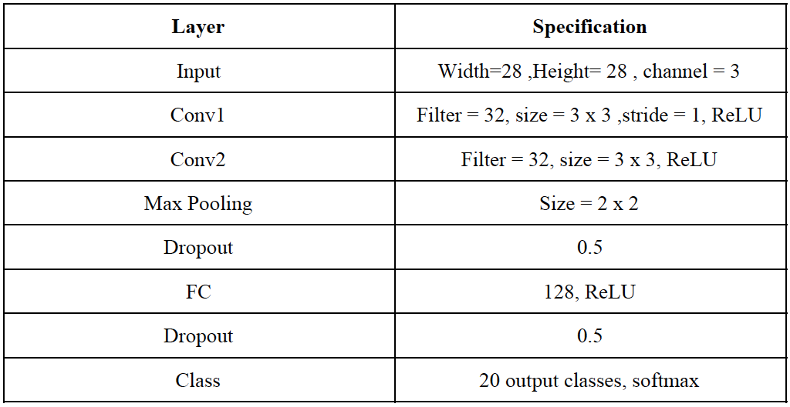
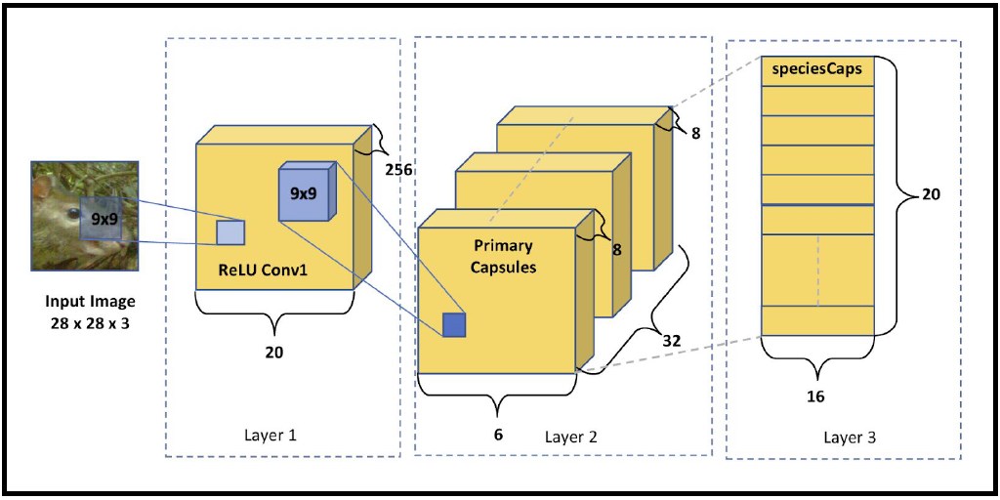
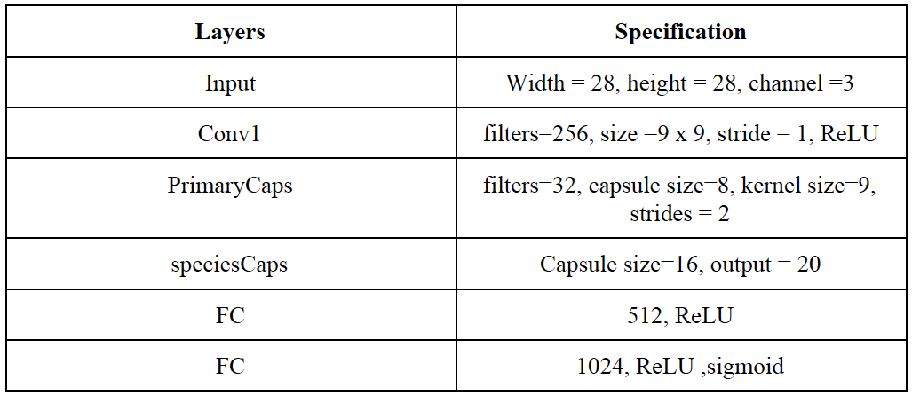
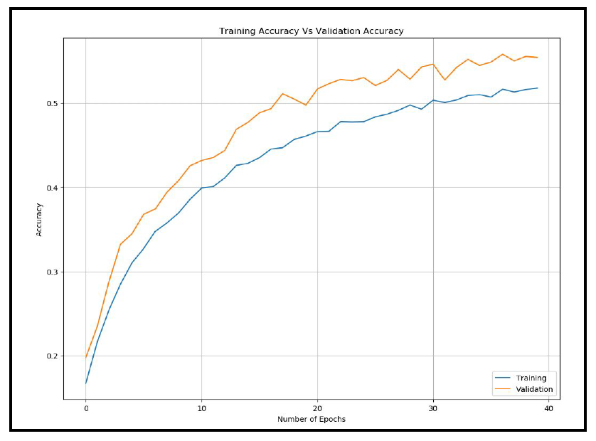
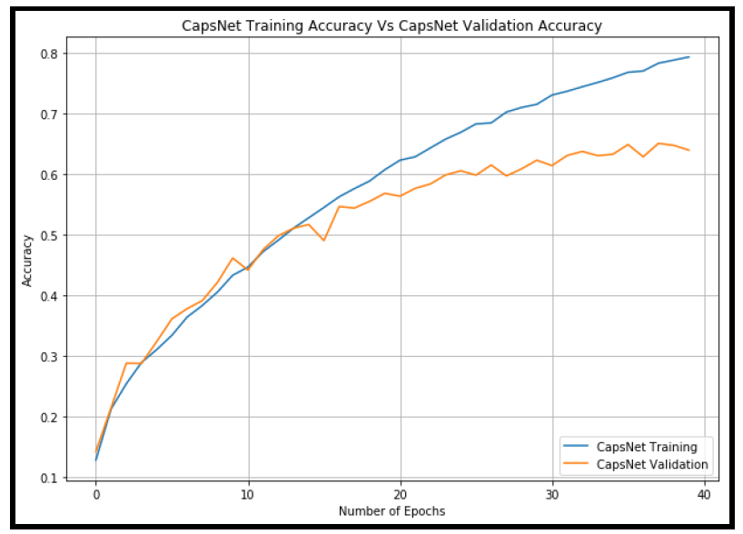

                                          MSc Data Science Thesis

# Vector Capsule Network for wild animal species recognition in Camera trap images

## Abstract
The most critical task in Ecology is observing and studying the wild animals in their natural habitat. Camera traps are the most helpful tools for ecologists and researchers for effective and constant monitoring of wild animals. Monitoring wildlife using camera traps is necessary as it helps researchers to understand human impacts on wildlife, and also help management to
make better decisions. However, annotating a large amount of camera trap data is time-consuming. Hence, auto tagging of the wild animal species in camera traps is of great importance, and its gaining speed as more and more deep learning solutions are being implemented on a variety of problems. One such computer-assisted system could be an auto-tagging tool which can classify diverse animal species in real-time. This work is an attept to present a new and novel deep neural networks called 'Capsule Network' as a solution to the problem of classifying wild animal species. Capsule Network is the latest development in Artificial Intelligence and is a new and exciting approach to computer vision. It has shown excellent results on various image recognition problems as per the research published so far. The work further tests the robustness of the newly introduced 'Capsule Network,' by comparing its performance with the Convolutional Neural Network. The results achieved indicate that the Capsule Networks are better at understanding images than ConvNets.

## Hypothesis
The camera trap images of wild animals are the kind of images where Convolutional Neural Networks may have a problem, because of species exhibiting a variety of poses and therefore, Capsule Networks can be expected to outperform Convolutional Neural Networks. Capsule Network has obtained state-of-the-art results on the dataset with the objects with affine transformations (https://arxiv.org/pdf/1710.09829.pdf), and can, therefore, be expected to perform better than Convolutional Neural Networks on camera trap images.

## Research Question 
Is Capsule Network better than Convolutional Neural Network in classifying wild animal
species in camera trap images?

## Dataset
An annotated camera-trap dataset of 20 species commonly found in North - America is used for training the model. The dataset contains 15826 images of 20 species namely Agouti, Bird spec, Coiban Agouti, Collared Peccary, Common Opossum, European
Hare, Great Tinamou, Mouflon, Ocelot, Paca, Red Brocket Deer, Red Deer, Red Fox, Red Squirrel, Roe Deer, Spiny Rat, White Tailed Deer, White-nosed Coati, Wild Boar, and Wood Mouse. The dataset contains a collection of gray-scale and color images. 

The images captured at night are in gray-scales and images captured in daytime are in colored.

Every image contains only one species out of 20 species. 80% of the dataset, i.e., 12660 images is used for training and the rest 20% for testing.

Link to Dataset Repo 

https://data.world/deana/camera-traped-wild-animals-images

or

https://drive.google.com/open?id=14vII7LJP8Hv-Uz4Av5DA33_Hyz95PL0I

## Convolutional Neural Network architecture used for wild animal species classification.

The architecture consists of two convolution layer with ReLU activation function and followed by a pooling layer with a dropout of 50%, and a final layer, a fully connected layer.

INPUT -> CONV1 -> ReLU -> CONV2 -> ReLU -> POOL -> DROPOUT -> FC -> ReLU -> DROPOUT - > FC - > SOFTMAX

#### CNN Specification

### Capsule Network Architecture used for wild animal species classification.

The architecture is similar to the one presented in paper (Hinton,Sabour and Frosst, 2017, https://arxiv.org/pdf/1710.09829.pdf).

INPUT -> CONV1 -> ReLU - >PRIMARYCAPS - > SPECIESCAPS -> FC -> FC

#### CapsNet Specification

## Hardware Used

Since image recognition using deep learning involves many complex matrix calculations, training a model requires a certain amount of computing resources. In recent year, the use of GPU ( Graphical Processing Units) is becoming popular for deep learning, without which the training would take several days or months to obtain practical results.

For the experiment, two systems are used as mentioned below:

(i) A Macintosh with macOS High Sierra (v10.13.3) with 1.8 GHz Intel Core i5, memory of 8GB 1600 MHz DDR3 and Intel HD Graphics 6000 of 1536 MB, to execute Convolutional Neural Network.

(ii) A cloud computing instance; Amazon's Web Services (AWS) EC2 cloud computing (Elastic Compute 2), is set up with g2.2xlarge GPU. This version of the instance has 15GB Memory, 60GB of local SSD storage, 8 vCPU and a single NVIDIA Kepler GK104 graphics card with 1536 CUDA cores, for the execution of Capsule Network.

# Programming language used

Python 3 is used as the programming language with keras framework using tensorflow backend. Keras is a user-friendly open source neural network library written in python. It can be used on top of tensorflow or theano.

# Traning the networks

The Convolutional Neural Network was trained on the first-mentioned hardware, and the Capsule Network was trained on the AWS cloud instance. Both the networks are trained using ADAM optimizer with an initial learning rate of 0.001. Since training
both the models is time-consuming and computationally expensive, the number of epochs chosen was 40 and a batch size of 32 for both the models.  

# Results 

The Convolutional Neural Network for wild animal species recognition without data augmentation achieved a test accuracy of 55.36% , and test loss (Mean Square Error) of 0.029 in 40 epochs.

The Capsule network architecture considered for this experiment achieved 63.90% accuracy and loss of 0.29 in 40 epochs with data augmentation.

# Conclusions

A Vector capsule network was presented to solve the problem of classifying wild-animal species in camera trap images. The Capsule Network achieved an accuracy of 63.90% which is not a satisfactory result but still outperformed the performance of Convolutional Neural Network which obtained an accuracy of 55.36% in classifying the wild animal species in camera traps. Hence, it proves that the hypothesis stated is correct, and answers to the research question that "Capsule Network is better than Convolution Neural Network in classifying the wild-animals in the camera trap images.",

